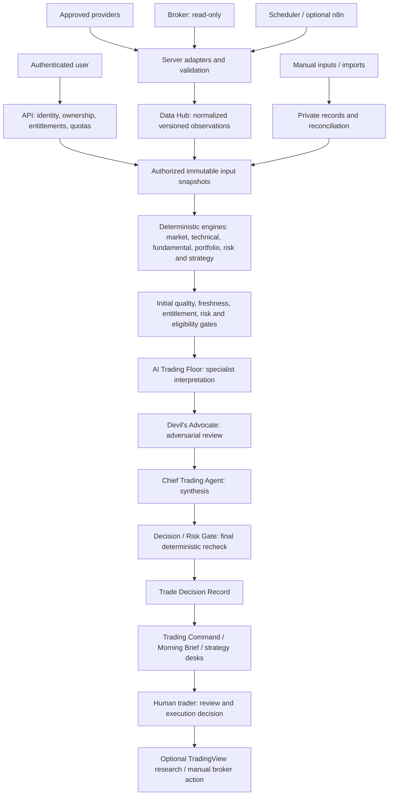

# Arowana Architecture 2.1

Status: **architecture direction including ATD-006A owner-approved 2026-09-29; documentation only**. Reconciled 2026-09-28 under ATD-006 on `codex/ATD-006-architecture-2-1-consolidation`, from local baseline `5620217768a667333b56971640881d36814520c3`.

Engineering foundation: the ATD-004 Architecture 2.1 draft, originally based on GitHub commit `bff6c5257d62f21a8dadd6d70f28fc8176010f92`, plus the [AI Trading Floor addendum](ARCHITECTURE_2_1_AI_TRADING_FLOOR_ADDENDUM.md), retained unchanged as historical/source design evidence. Primary data sources: [ATD-004 inventory](ATD-004_DATA_SOURCE_INVENTORY.md) and [Data Hub contract v0.1](ATD-004_DATA_HUB_CONTRACT.md). Migration evidence: [ATD-001](ATD-001_REPOSITORY_AUDIT.md). Security dependencies: [ATD-002](ATD-002_SECRET_CLIENT_KEY_INVENTORY.md) and [ATD-005](ATD-005_SUPABASE_SCHEMA_RLS_AUDIT.md).

This proposal expands the [existing architecture](ARCHITECTURE.md). It does not approve the ATD-004 contract, establish provider rights, remediate security findings, or authorize deployment. ATD-004 remains the detailed dataset/API specification; any future disagreement must be resolved in both documents before implementation. Architecture version 2.1 does not change the proposed API `/api/data/v1` or envelope schema version `1.0.0`.

## 1. Product and authority

Arowana is a private-beta research and decision-support platform for the owner and approved users. Trading Command is the command center; Swing, Wheel, Growth/AI, Options and Long-Term are strategy desks sharing the same data and risk services. Wheel is one desk, not the platform identity. TradingView remains the deep charting surface, and the broker remains the execution and custody system.

The central rule is: **data supplies observations; deterministic engines calculate facts; AI explains those facts; risk rules constrain strategy plans; the user decides what to do.** An execution plan is a document, never an order. No broker order endpoint, trading permission or autonomous execution is included.

**Shared-Brain Principle:** Swing, Wheel, Options, Growth/AI and Long-Term consume the same Data Hub, Market Engine, Technical/POC Engine, Fundamental Engine, Portfolio Engine, Risk Engine and Strategy services. Desks own strategy-specific workflows and views, not separate factual pipelines or independent AI traders.

**No AI agent, including the Chief Trading Agent, may override a hard deterministic Risk Engine rejection.** AI interprets risk; the Risk Engine owns hard constraints. Human review does not change a failed system gate into a passed gate. The human retains the final decision whether to trade outside Arowana's read-only broker boundary.

## 2. Current state versus target

| ATD-004 finding | Architecture 2.1 response |
|---|---|
| Browser calls, provider keys, interception shims and configurable webhooks coexist | Explicit authenticated server API and registry-owned adapters; server-held credentials |
| Quote timestamps are discarded and cache keys omit feed/adjustment/entitlement | Provenance-preserving observations and policy-aware cache identity |
| Fallback changes history depth or semantics | Capability checks and explicit fallback policy; insufficient history blocks calculations |
| Journals, browser mirrors and portfolio stores overlap | One authoritative account snapshot, stable account IDs and reconciliation before aggregation |
| Demo fundamentals can acquire a live price label | Production facts exclude demo data; assumptions and manual inputs remain separately labeled |
| Deployed backend definitions are missing from Git | Versioned DEV baseline, migrations and service source before new implementation relies on them |
| Provider access and redistribution rights are unverified | Dataset/feed/user entitlement gates before retrieval and delivery |

These are target responsibilities, not claims that the services already exist. The inventory's sampled code and ATD-005's dated metadata are evidence of current gaps; this follow-up did not inspect live application data or re-audit deployed services.

The normalized Data Hub, shared deterministic engines, AI Trading Floor, Devil's Advocate, Chief Trading Agent, Decision Gate and Trade Decision Record below are target components. Existing browser workflows, fragmented caches, overlapping journals/portfolio sources and partial backend definitions do not establish their implementation.

## 3. Target system flow



The diagram describes logical boundaries, not a requirement to deploy a separate microservice for every box. Start with shared server modules and a small set of explicit endpoints. Supabase remains the target authentication, database and backend platform; exact worker placement and deployment topology require the decisions in section 10.

The Chief orchestrates the workflow before its final synthesis step; the diagram shows evidence flow rather than a rigid call stack. Failed prerequisites can produce a non-actionable record without invoking AI. The initial gates prevent ineligible candidates entering actionable analysis; final checks prevent synthesis, a changed plan or elapsed time from bypassing those gates (section 7).

## 4. Component responsibilities

| Component | Owns | Boundary |
|---|---|---|
| API and authorization | Verified identity, account ownership, dataset entitlements, validation, pagination and safe errors | Caller-supplied user IDs, plans and URLs confer no authority |
| Provider registry | Approved adapter, dataset/feed capability, quota, rights and fallback policy versions | A working key does not establish permission to distribute data |
| Adapters and ingestion | Provider mapping, event times, validation, idempotency and source revisions | Invalid or incomplete upstream data cannot become a successful fact |
| Observation and snapshot store | Versioned facts, provenance, quality and immutable input manifests | Refresh creates new evidence; it does not rewrite old input sets |
| Private record services | Accounts, journal events, annotations, watchlists, imports and reconciliation | Market read routes cannot write broker/provider-trusted facts |
| Deterministic engines | Versioned formulas, parameter hashes, input references and eligibility | Missing inputs produce unavailable results, never invented defaults |
| AI Trading Floor | Specialist interpretation, challenge and claim-to-fact references | No authority over prices, indicators, Greeks, positions or risk totals |
| Devil's Advocate | Attempts to invalidate the thesis and exposes underweighted evidence | Adversarial review, not another vote; material objections remain visible |
| Chief Trading Agent | Orchestration, agreement/disagreement synthesis and record assembly | Cannot override deterministic eligibility, risk limits or entitlements |
| Risk Engine | Authoritative exposure, sizing calculations and hard risk constraints | Its hard rejection is non-bypassable by any AI role |
| Strategy services / Decision Gate | Deterministic strategy eligibility and validation of the final plan | Recheck facts, permissions and risk before assigning a review-ready state |
| Strategy desks | Strategy-specific workflows/views over shared services and records | No independent factual pipeline |
| Trading Command | Trader-facing prioritization and decision workflow | Presents limitations and material objections alongside opportunities |
| Human trader | Final execution decision | Arowana creates decision support; it does not submit orders |
| UI compatibility layer | Shared API client, legacy view mapping and visible data status | Preserve stable links; do not expose raw provider response shapes |

ATD-003 owns the canonical navigation map and was authorized by the owner on 2026-09-29. Internal agents should generally not become separate top-level pages. Their intelligence normally surfaces through Trading Command, Morning Brief, What Changed, Analysis, Swing, Wheel, Options, Growth/AI, Portfolio/Risk and Journal/Review. These are workflow examples, not a final menu or route design; no legacy route is chosen or renamed here.

## 5. Data foundation

### Target acquisition responsibilities

| Source | Proposed responsibility | Enablement gate |
|---|---|---|
| Alpaca | Equity quotes/trades/bars and option quotes/chains | Verify each feed, history, coverage and beta-user distribution right |
| FMP | Fundamentals, estimates and separately verified calendar/action capabilities | Validate endpoint versions, fiscal semantics and licensed history |
| FRED | Macro observations and vintage-aware history | Approve series catalog and publication/vintage handling |
| SEC EDGAR | Filing metadata and accession-linked facts | Validate identity, units, periods, amendments and access rules |
| Schwab, later | Read-only accounts, balances, positions and transactions | Approved OAuth boundary, account mapping and reconciliation |
| Finnhub / Twelve Data / Alpha Vantage | Temporary legacy bridges where approved | Server-side secrets, equivalent semantics and an explicit retirement plan |

These roles come from ATD-004; subscriptions and current capabilities have not been verified here. n8n is an optional job orchestrator, Supabase is a storage/access platform, and TradingView is a research surface. None replaces the original source attribution of a market observation.

### Logical ownership and storage

| Data family | Authority and identity | Storage/access rule |
|---|---|---|
| Instruments and mappings | Stable instrument ID; dated provider mappings; full option deliverable identity | Shared reference data subject to applicable rights |
| Market/fundamental/macro observations | Source record, feed, period/event and revision | Immutable versions; sharing only where licensed |
| Accounts and private journal events | Verified owner/account and stable event/import IDs | Private, same-owner parent relationships enforced |
| Positions and cash | One reconciled authoritative snapshot per account | Broker, manual and imported origins explicit; no mirror double counting |
| Watchlists and annotations | User-authored preferences, separate from market facts | Owner-scoped CRUD and same-owner list/item invariant |
| Engine results and AI narratives | Input snapshot IDs and formula/model/prompt versions | Derived private context inherits input restrictions |
| Trade Decision Records | Identified candidate, assessments, gate outcomes and immutable evidence references | Derived private artifact; inherits account ownership, entitlement and retention restrictions |
| Jobs and raw payload references | Job scope, adapter version, deduplication key and result | Internal access; license/privacy-bounded retention |

Physical schemas, table names and migrations remain a separately scoped implementation decision. Similar legacy table names are not sufficient evidence to select a canonical model.

All numeric and time semantics follow ATD-004: decimal strings for money/quantity, explicit units and rounding, null with a reason for unknown values, original event or observation date, separate receipt/ingestion/computation times, and publication availability plus revision/vintage for point-in-time use. Unknown availability excludes a record from point-in-time testing. Option identity includes multiplier and adjusted deliverable; multiplier 100 is not assumed.

Snapshots retain the exact eligible input versions, parameters and policy versions needed to reproduce a calculation. A reproducibility claim is limited by licensed retention: where inputs must be deleted, the system records that limitation and does not claim replay remains possible.

## 6. Request and job lifecycle

1. Validate authentication, server-derived entitlements, requested account ownership and bounded query parameters. Reject arbitrary provider URLs, workflow destinations or client credentials.
2. Resolve stable instrument identities and required dataset/feed semantics. Request limits may tighten server policy, never relax it.
3. Check the authorized cache partition. Include provider/feed, mapping/schema version, adjustment, session, query/as-of and entitlement partition; add owner/account for private data.
4. If refresh is needed, use an approved adapter under coordinated provider, user and global quotas. Background jobs use scoped worker identity and deduplication; n8n results require verified authentication, replay protection and job ownership.
5. Validate provider payloads, including errors returned with HTTP 200. Preserve event times. Same identity/hash is a no-op; changed content becomes a revision or recorded conflict.
6. Build an immutable snapshot and apply freshness, coverage, completeness and consumer eligibility policies. Never silently merge incompatible feeds or adjusted series.
7. Return the ATD-004 envelope with request/snapshot IDs, per-item outcomes, provenance, quality and query-bound pagination. Recheck authorization on later pages and cache delivery.

The proposed `/api/data/v1` routes cover instruments, quotes, bars, options, fundamentals, estimates, macro, filings, portfolio snapshots and capabilities. Exact fields and bounds stay in ATD-004. Private CRUD and internal ingestion are separate contracts. No route is implemented by this document.

### Failure and freshness behavior

Freshness, feed delay, coverage and cache expiry are independent. A fresh single-exchange observation does not satisfy consolidated-feed requirements. Closed-market values retain their last session label. Missing authentication or incomplete account retrieval cannot appear as zero exposure.

ATD-004's proposed budgets remain **unapproved defaults**: equity quote age 60 seconds, option quote age 30 seconds with underlying age 60 seconds, completed minute bars within two minutes, and portfolio snapshot age five minutes for risk inputs. Daily history uses expected completed sessions; fundamentals/estimates have a 24-hour refresh target rather than an intraday freshness claim. Option timestamp skew still requires an explicit budget.

Display stale or partial information only with its status and as-of time. Suppress actionable outputs when required inputs fail eligibility. Distinguish unavailable items from verified empty datasets. Entitlement failures cannot fall back to another user's key or stale cache. Retry only eligible transient failures under a bounded deadline; ATD-004 proposes at most two retries, with backoff and circuit breaking.

## 7. Engines, AI and decision surfaces

| Engine / layer | Inputs and output | Required limitation |
|---|---|---|
| Market Regime (ATD-102) | Approved market/macro snapshots to versioned regime measures | Formula, universe and breadth/history coverage must be explicit |
| Technical + POC (ATD-103) | Complete bars and suitable volume/trade data to indicators and profiles | Daily-bar approximations cannot be presented as measured intraday POC/VWAP |
| Fundamental / EPS Revision (ATD-104) | Fiscal facts and comparable estimate snapshots to metrics/revisions | No historical revision result without comparable historical inputs |
| Portfolio & Risk (ATD-105) | Reconciled positions/cash and eligible prices to exposure and limits | Include shorts/options correctly; missing accounts block complete-risk claims |
| Strategy services | Engine facts, user rules and risk results to candidate plans | Wheel/options use eligible contracts and declared IV/Greek methods |
| AI Trading Floor / Chief Trading Agent | Authorized snapshots and engine results to specialist analysis, challenge and synthesis | Preserve fact citations; unsupported numbers cannot enter authoritative fields |
| Trading Command / Morning Brief (ATD-106/107) | Shared snapshots, evaluated results and Trade Decision Records to priorities and changes | Show source, time, delay, incomplete coverage, objections and blocked actions |

Strategy formulas and AI prompts need later versioned contracts. AI may suggest a scenario with clearly labeled assumptions, but deterministic services calculate and validate its numbers. "What Changed" compares identified snapshots and revisions; a regenerated narrative alone is not a new market event. The Wheel port (ATD-108) requires a separate source review and parity checks against these same contracts.

### Specialized AI responsibilities

The AI Trading Floor is downstream of immutable snapshots and deterministic engine outputs. Each role consumes authorized evidence and retains fact/result references rather than acquiring an independent data feed.

| Logical role | Responsibility | Authority limit |
|---|---|---|
| Market Agent | Explain regime, breadth, sector leadership and macro/event context, including conflicts | Market Engine owns measured regime/breadth values |
| Technical Agent | Interpret trend, momentum, volume, support/resistance, available 5-day/20-day swing POC, triggers, invalidation and timeframe conflicts | Technical/POC Engine owns calculations; screenshots cannot substitute for authoritative indicators or unavailable POC |
| Fundamental Agent | Explain business quality, growth, margins, cash flow, valuation, estimates, EPS revisions and filing/earnings risks | No plausible substitutes for missing financial facts or historical snapshots |
| Portfolio Agent | Explain reconciled exposure, concentration, sector/correlation overlap, strategy exposure and account fit | Portfolio Engine owns positions and measures; incomplete retrieval is not zero exposure |
| Strategy Agent | Compare approved Swing, Wheel, long stock, defined-risk options, Growth/AI accumulation, Long-Term, wait or no-trade structures | Deterministic Strategy services validate eligibility and calculations |
| Risk Analyst | Explain sizing, buying power, concentration, assignment/exercise exposure, events and liquidity | Risk Engine owns hard constraints; analysis cannot relax them |

These are logical responsibilities, not six separate services or paid model calls. A structured invocation may cover multiple roles when traceability is preserved. Routine watchlist refreshes may remain deterministic; AI may run after material changes. Model choice, budgets, latency targets and invocation policy require later implementation decisions. Combined calls do not make their outputs independent corroborating evidence.

### Devil's Advocate and evidence discipline

Devil's Advocate is a first-class adversarial role whose purpose is to invalidate a proposed trade or identify material evidence the primary analysis underweighted. It is **not another vote**. Challenges may address market regime, technical structure, entry quality, reward/risk, upcoming events, fundamentals, EPS revisions, portfolio concentration, liquidity, options structure, strategy fit, conflicting timeframes or stale/incomplete evidence.

Retain material objections, supporting evidence references, unresolved disagreement and the Chief's response in the Trade Decision Record. A response may explain a concern but cannot silently delete it or turn a failed deterministic gate into a pass. Adversarial review is required before a candidate reaches READY FOR HUMAN REVIEW; blocked candidates and routine monitoring may skip it with the reason recorded. Missing required review prevents readiness. The Devil's Advocate must evaluate the proposal version intended to proceed to human review; an adversarial review of a materially different earlier proposal version does not satisfy this requirement (see [Final proposal and review binding](#final-proposal-and-review-binding-atd-006a)).

Agent count alone never authorizes a trade. The pattern "7 of 8 agents bullish; 87.5% consensus; BUY" is explicitly rejected, as are arbitrary thresholds such as 76.8%. Hard risk, entitlement, quality and eligibility failures cannot be averaged away. Any future confidence/evidence score requires a separately assigned task, a documented definition and validation methodology; no such score is introduced here.

### Chief Trading Agent orchestration

The Chief gathers approved immutable snapshot references and deterministic results, requests relevant specialist analysis, identifies agreement/disagreement, invokes adversarial review and evaluates strategy context. It checks the returned quality and eligibility results, respects deterministic risk and assembles the Trade Decision Record for validation. The server-side Decision Gate, not the model's assertion, determines whether the proposed record may be marked ready for human review.

The Chief cannot invent prices, Greeks or financial facts; fetch arbitrary unapproved providers; bypass freshness, entitlements or deterministic eligibility; override hard risk; or place broker orders. Suggested changes to entry, size, account, instrument or strategy are new proposals requiring applicable deterministic recalculation and gating. The Chief's orchestration authority is not permission to modify risk policy.

The Chief may synthesize evidence, identify disagreement, suggest a modified proposal and request another analysis cycle. If the Chief materially modifies a proposal, it cannot carry forward affected specialist assessments or adversarial review from the earlier version, and it cannot self-certify the changed proposal as READY FOR HUMAN REVIEW; readiness follows the [final proposal binding](#final-proposal-and-review-binding-atd-006a) rules and the server-side Decision Gate.

### Decision Gate and non-bypassable risk

The conceptual sequence is:

```text
DATA QUALITY -> FRESHNESS / ENTITLEMENT -> ENGINE INPUT ELIGIBILITY
    -> DETERMINISTIC RISK -> STRATEGY ELIGIBILITY
    -> SPECIALIST AI ANALYSIS -> DEVIL'S ADVOCATE -> CHIEF TRADING AGENT
    -> FINAL DECISION / RISK RECHECK -> TRADE DECISION RECORD -> HUMAN REVIEW
```

Initial checks apply to the candidate and known deterministic inputs. If AI or a user proposes a different structure, the final gate evaluates that exact structure against approved policy and eligible inputs. A hard risk rejection yields BLOCKED regardless of supportive analysis. New evidence or a revised proposal may be evaluated afresh, retaining the earlier rejection; neither is an override of that rejection.

Recheck applicable quality, freshness, authorization/entitlements, engine inputs, risk and strategy eligibility before review-ready delivery. An expired quote, revoked entitlement or changed account state requires new validation and, where needed, a new snapshot/record. Historical records preserve their original outcome and generation time but do not confer perpetual readiness or access. AI narrative cannot convert unavailable to available, partial to complete, delayed to realtime, unauthorized to authorized or failed risk to passed risk.

#### Final proposal and review binding (ATD-006A)

Every proposed trade/execution plan has a proposal version or equivalent immutable proposal identity. Conceptually, a proposal version represents the exact plan being evaluated, defined where applicable by instrument, strategy, account, direction, stock or options expression, option contract identity (including strike, expiration and deliverable), entry/trigger, position size/risk, invalidation/stop, exit structure and other strategy-defining parameters. Each specialist assessment and Devil's Advocate review must reference the exact proposal version evaluated, the relevant immutable input snapshot IDs within its required input snapshot set, applicable engine/policy versions, analysis/model/prompt versions where AI is used, and its assessment time. Required deterministic results must likewise be attributable to that proposal and input set. Roles may use different relevant subsets of the same identified input set; evidence from incompatible proposal versions or input sets cannot be combined to establish readiness.

A material change by the Chief Trading Agent or a user creates a new proposal version and makes affected reviews invalid/stale for that version. Material changes include, where applicable: strategy; instrument; account; long/short direction; stock versus options expression; option contract, strike or expiration; entry/trigger changes that materially alter the thesis; position size or risk; exit/invalidation; and any other change that materially alters strategy, risk, portfolio fit or the evidence required to evaluate the trade. Historical assessments retain their original bindings and must not be silently relabeled as reviews of the new proposal.

Materiality is determined from the parameters actually changed under versioned policy, not from the proposing agent's own characterization of its change. Numeric thresholds for material entry/size changes, and the mapping from changed parameters to affected specialist roles, require later versioned policy (section 10); until defined, any change to a strategy-defining parameter is treated as material and every assessment depending on a changed parameter is treated as affected. Devil's Advocate review is always affected by a material change.

After a material change, rerun deterministic calculations and risk, refresh affected specialist assessments, and have Devil's Advocate review the resulting final proposal. Any retained unaffected assessment requires an explicit applicability validation for the final proposal version and required input set, preserving its original assessment reference and recording that validation. Changes to relevant snapshots or applicable engine/policy versions also require revalidation and refresh of affected evidence; unchanged proposal text alone does not make old evidence valid.

The revision sequence after a material change is:

1. Create or identify the new proposal version, linked to its predecessor.
2. Re-run affected deterministic calculations.
3. Re-run deterministic risk validation.
4. Mark affected specialist assessments stale/invalid for the new version.
5. Refresh the affected specialist assessments.
6. Run Devil's Advocate against the resulting proposal version.
7. Perform the final deterministic eligibility/risk recheck.
8. Produce or update the Trade Decision Record using only valid results associated with the final proposal version and required snapshot set.
9. Only then may the proposal become READY FOR HUMAN REVIEW.

A hard risk rejection or other mandatory failure at any step yields BLOCKED. The treatment of earlier reviews is deliberately asymmetric: a material objection raised against an earlier version that still applies is carried forward and addressed in the final record, whereas a supportive assessment of an earlier version cannot stand in for review of the final version.

```text
Proposal v1: NVDA long stock swing
  Technical, Portfolio and Devil's Advocate review v1.
Chief changes the plan to Proposal v2: NVDA bull call spread.
  Risk Engine recalculates v2 and passes.

INVALID: reuse the v1 reviews and mark v2 READY FOR HUMAN REVIEW.

VALID:   the strategy/options change creates v2; the analyses affected by
         the new structure are re-run for v2; Devil's Advocate evaluates v2;
         final risk/eligibility is revalidated for v2; the Decision Record
         references v2 (linking v1 and any still-applicable v1 objections).
         Only then may v2 become READY FOR HUMAN REVIEW.
```

A changed proposal and changed evidence are distinct triggers. When the proposal changes materially, a new version is created even if the snapshots are unchanged. When market, fundamental, macro or portfolio evidence changes but the proposal parameters do not, the proposal version stays the same; assessments bound to superseded evidence become stale where the existing freshness, snapshot and eligibility rules (section 6, this Decision Gate and ATD-004) make a relied-upon input ineligible, or deterministic comparison of identified snapshots/revisions shows a change to eligibility or an assumption the assessment relied on. This introduces no second freshness system or new budgets. Evidence updates that affect neither eligibility nor relied-upon assumptions do not by themselves require re-analysis, although the final deterministic recheck still applies.

**READY FOR HUMAN REVIEW requires all required deterministic results, specialist assessments and adversarial review to be valid for the SAME final proposal version and required immutable input snapshot set.** The Decision Gate verifies these bindings as well as the existing eligibility/risk gates. A mismatch, stale required review or missing validation prevents readiness. The Trade Decision Record references that final proposal version and its resulting validated assessments and deterministic results.

Non-material presentation/narrative edits, such as formatting or wording that changes no thesis, assumption, trigger, risk, strategy or input evidence, do not require unnecessary re-analysis. They must preserve the underlying immutable proposal identity and evidence bindings; this exception cannot be used to hide a material plan change. These are conceptual invariants, not a physical schema or implementation.

| Decision-support state | Meaning |
|---|---|
| BLOCKED | A mandatory prerequisite fails or cannot be established, including a hard deterministic risk rejection; include reason and gate evidence |
| REJECT | The thesis or structure is not supported after review; cannot mask a mandatory gate failure |
| WAIT | A defined confirmation, entry or event condition is pending; not an actionable approval |
| WATCH | Monitor the candidate and identified triggers; not an actionable approval |
| READY FOR HUMAN REVIEW | Required evidence, reviews and final deterministic gates pass for the specified final proposal version, with every required assessment bound to that version and its required snapshot set; the human still decides |

These are proposed decision-support semantics, not order types or a physical/API enum migration. BLOCKED takes precedence over favorable AI conclusions. A record may document a blocked outcome without running specialists or adversarial review; skipped analysis is explicit. No decision-support state submits a broker order.

### Trade Decision Record

The core derived artifact is an auditable Trade Decision Record, not a BUY/SELL label or agent consensus percentage. Conceptually it retains:

| Evidence group | Retained information |
|---|---|
| Candidate and context | Final immutable proposal version/identity, instrument identity, strategy, authorized account/portfolio context and proposed structure |
| Assessments | Market, technical, fundamental, portfolio-fit and strategy-fit assessments and adversarial review, with final-proposal validity, relevant immutable snapshot IDs, applicable engine/policy versions and any retained-assessment applicability validations |
| Gate outcomes | Data-quality, freshness, entitlement, input eligibility, deterministic risk and strategy states; reasons, limitations and checks not performed |
| Interpretation and challenge | Specialist interpretations, material Devil's Advocate concerns (including still-applicable objections raised against earlier proposal versions), disagreement, Chief assessment and response to objections |
| Plan | Trigger, invalidation, deterministic approved risk/sizing context if available, and decision-support status; blocked records cannot imply approved sizing |
| Audit references | Proposal version and links to earlier versions, input snapshot IDs, engine/formula and policy versions, AI/model/prompt references where used, assessment times and generation timestamp |

Distinguish measured facts, deterministic calculations, AI interpretation and user assumptions explicitly. Unknown or skipped assessments remain unknown/skipped, not fabricated positive ratings. Numeric trigger, invalidation and sizing values retain their source or assumption status and required deterministic validation.

The record references immutable inputs and inherits their private ownership, licensing and retention boundaries. Re-evaluation creates a linked new version rather than rewriting prior evidence. Human accept/reject/modify/wait feedback is distinguishable from the original system result; a modification needs reevaluation before a new review-ready result. Proposal revision does not hide material objections: those still applicable remain visible with the Chief's response. Physical tables, persistence schema, endpoints and detailed field contracts belong to later implementation tasks, not ATD-006.

### Trader-facing use and human execution

Trading Command prioritizes decisions using these records. Morning Brief summarizes what matters before the session; What Changed compares identified snapshots and material record changes; strategy desks apply their specific workflows to shared evidence. Journal/Review may relate later user decisions to the original record without rewriting its evidence.

Arowana supplies research, analysis, risk evaluation and execution plans. The human user decides whether to trade, optionally reviews TradingView and executes manually with the broker. Schwab remains read-only under Architecture 2.1; no autonomous execution, order endpoint or order-write scope is introduced.

## 8. Security and deployment boundaries

Establish isolated DEV configuration and synthetic fixtures before new consumers depend on the Hub. Version backend source, migrations, grants, policies and deployment configuration in Git; exclude credentials. Production rollout remains separately authorized. The shared Arowana/Salon project boundary is unresolved; do not assume one schema alone resolves all cross-product exposure.

Private ownership must hold in API handlers, database relations, jobs, caches, storage and results. ATD-005's watchlist policy alternatives and account/entity parent ownership gaps are explicit blockers. Privileged adapters must validate scope even when database RLS is bypassed. Review exposed views and RPCs as well as tables. Object grants and row policies are separate controls, as described in [Supabase's API security documentation](https://supabase.com/docs/guides/api/securing-your-api).

Keep provider secrets and broker tokens in server-only storage with rotation/revocation handling. ATD-002's browser hydration, alternate stores and webhook flows need assigned containment and migration work. Broker callbacks validate state, redirect and ownership; no order-write scope is permitted. This proposal does not read, rotate or move any credentials.

Monitor request/job IDs, latency, quota use, ingestion lag, stale rate, missing history, feed changes, schema drift and reconciliation failures. Logs exclude keys, bearer tokens, OAuth codes and unrestricted private payloads. Retention, deletion and backups require explicit policy and a tested recovery path before production migration.

## 9. Delivery sequence and evidence gates

| Stage | Scope | Required evidence before moving on |
|---|---|---|
| Review | Owner review of consolidated Architecture 2.1, Data Hub contract and section 10 decisions | Architecture approval before assigning ATD-003; separately assigned security remediation; ATD-101 gates remain in force |
| Secure DEV baseline | Version backend definitions; remediate relevant secret/ownership paths in DEV | Reproducible setup; positive and negative two-user authorization tests |
| ATD-101 first slice | One approved equity quote/bar adapter, normalization and one consumer compatibility layer | Mapping/schema fixtures; entitlement, freshness, quota and fallback checks |
| Data expansion | Reconciled private snapshots, fundamentals/estimates, macro and filings in reviewed slices | Import idempotency, revision/vintage checks and reconciliation evidence |
| Engines and UI | Implement ATD-102 through ATD-107 in dependency order | Golden calculations, fact-linked AI, and desktop/mobile error-state checks |
| Wheel and retirement | Inspect/port ATD-108 modules; retire superseded legacy paths incrementally | Consumer parity, preserved user records and tested secure rollback |

Synthetic coverage must include sessions/DST/holidays, splits/dividends, missing versus zero, provider 200-error payloads, compact history, duplicate ingestion, partial pagination, revoked entitlements, account switching and changed fiscal/vintage records. Tests must exercise actual future adapters and authorization boundaries, not just document examples.

AI/decision acceptance must additionally show that supportive specialists and Chief synthesis cannot override a risk rejection; mandatory failures take precedence over all other statuses; material objections survive record assembly; skipped required review prevents readiness; and AI claims retain fact references. Test combined-role calls, stale or revoked inputs during synthesis, revised plans requiring recalculation, unavailable AI, record versioning and inherited private access. Proposal-binding tests must show that assessments or adversarial review of an earlier materially different version leave the revised proposal non-ready; that superseded evidence stales the assessments bound to it; that non-material wording edits do not trigger re-analysis; and that the final record references only results valid for the final proposal version. Unsupported or missing required analysis must leave the candidate non-ready. These are future implementation tests, not tests executed by this documentation task.

Migrate one consumer at a time behind a stable contract and preserve legacy links. Rollback selects a previously validated server implementation or disables the new slice; it must never restore browser credentials or an insecure provider path. No broad HTML rewrite is part of this architecture assignment.

## 10. Decisions required from the owner

The recommendations below are proposals, not accepted product decisions.

| Decision | Proposed starting position | What remains to approve |
|---|---|---|
| Beta distribution and feeds | Enable only verified dataset/feed/user combinations | Alpaca stock/options rights, coverage and redistribution scope |
| Fundamentals and estimates | Validate a narrow FMP capability set first | Endpoint/history access and comparable estimate snapshots |
| Initial universe | Begin with a bounded equity universe and one quote/bar consumer | Symbols, asset classes, sessions, history depth and first consumer |
| Freshness | Use ATD-004 budgets for DEV evaluation | Production budgets, option skew and stale-display permissions |
| Private canonical model | One reconciled source per account snapshot | Account/journal mapping, conflict rules and manual/broker authority |
| Environment boundary | Isolated DEV; explicit Arowana service ownership | Shared versus separate project and production deployment topology |
| Workflow ownership | Registry-controlled jobs; optional n8n | Approved operators, destinations and server credentials boundary |
| History and retention | Preserve only licensed, necessary versions | Point-in-time scope, raw/normalized retention, deletion and recovery periods |
| AI Trading Floor and decision policy | Logical roles sharing approved evidence, adversarial review before readiness, deterministic hard veto | Owner approval of this consolidation; later role/prompt contracts, model/privacy choices, invocation budgets, record lifecycle, material-change thresholds and changed-parameter-to-affected-role policy |

Architecture 2.1 including ATD-006A was owner-approved on 2026-09-29, authorizing ATD-003 navigation planning. ATD-101 remains PLANNED and gated on Architecture/Data Hub contract approval, provider/feed decisions, security remediation, entitlement/licensing decisions and a secure DEV baseline. Architecture approval does not approve the ATD-004 child contract or complete remediation.

## 11. Document validation and limits

ATD-006 checks documentation links, whitespace, the repository's existing limited-pattern secret scanner, changed-file scope and preservation of source documents. It adds no executable implementation, so it makes no claim about runtime authorization, provider entitlement, calculation accuracy, UI behavior or deployment readiness. ATD-004 inventory/contract, the AI Trading Floor addendum, the baseline architecture and prior audit reports remain unchanged. No credentials were retrieved from credential stores, used or modified; the repository scanner checks source text without reporting secret values. Neither ATD-003 nor ATD-101 was started.

### Reconciliation decisions

There is no fundamental authority conflict between the engineering foundation and the addendum. The following ambiguities are resolved in this proposal:

| Source ambiguity | Consolidated interpretation |
|---|---|
| The addendum places risk before Chief synthesis in some sequences and after it in the overview | Initial deterministic eligibility/risk checks plus a final check on the synthesized plan; neither is owned by AI |
| The Chief produces the record, while the final gate follows the Chief | Chief assembles interpretation; the deterministic gate validates status before the record is presented |
| The addendum permits selective adversarial invocation while also making it a decision stage | Monitoring/blocked candidates may skip with an explicit reason; readiness requires adversarial review and retained material objections |
| Hard risk is described as a rejection, while both BLOCKED and REJECT appear as states | Hard deterministic rejection maps to BLOCKED; REJECT describes an unsupported thesis, never a relabeling that hides failed gates |
| Specialist roles might imply separate services or votes | Roles may share structured invocations; counts and percentages confer no authority |
| A changed proposal required deterministic recalculation, but earlier reviews were not explicitly invalidated (ATD-006A) | A material change creates a new proposal version; affected specialist assessments and Devil's Advocate review must be refreshed for the final version before readiness |

The addendum remains historical design evidence rather than a second competing implementation contract. Owner approval on 2026-09-29 authorizes navigation planning; it does not promote this document over `ARCHITECTURE.md` or approve the ATD-004 child contract.
