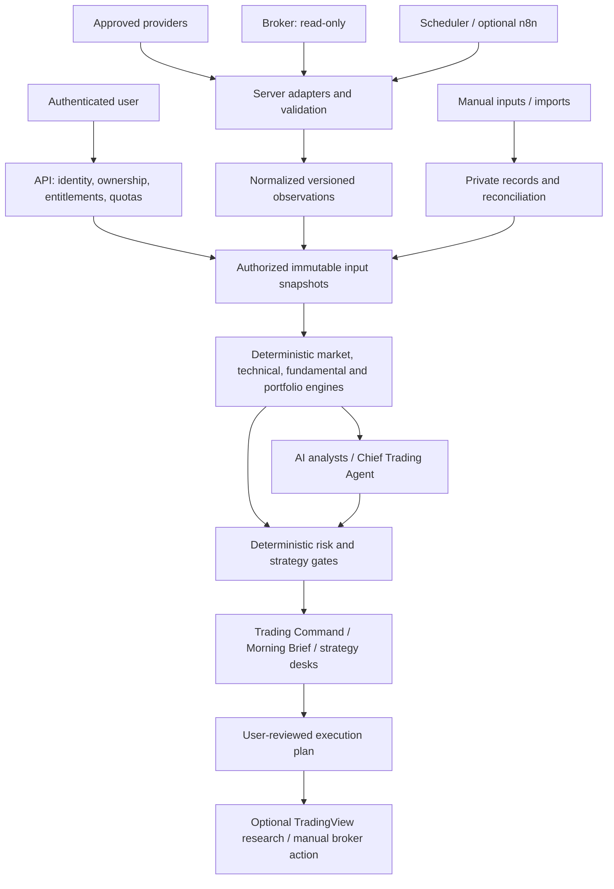

# Arowana Architecture 2.1

Status: **proposed for owner review; documentation only**. Prepared 2026-09-28 as the user-requested ATD-004 follow-up on `codex/ATD-004-architecture-2-1`.

Source baseline: GitHub `exodonprofits/Arowana_V2.0` main commit [`bff6c5257d62f21a8dadd6d70f28fc8176010f92`](https://github.com/exodonprofits/Arowana_V2.0/tree/bff6c5257d62f21a8dadd6d70f28fc8176010f92), verified against the live remote. Primary sources: [ATD-004 inventory](ATD-004_DATA_SOURCE_INVENTORY.md) and [Data Hub contract v0.1](ATD-004_DATA_HUB_CONTRACT.md). Security dependencies: [ATD-002](ATD-002_SECRET_CLIENT_KEY_INVENTORY.md) and [ATD-005](ATD-005_SUPABASE_SCHEMA_RLS_AUDIT.md).

This proposal expands the [existing architecture](ARCHITECTURE.md). It does not approve the ATD-004 contract, establish provider rights, remediate security findings, or authorize deployment. ATD-004 remains the detailed dataset/API specification; any future disagreement must be resolved in both documents before implementation. Architecture version 2.1 does not change the proposed API `/api/data/v1` or envelope schema version `1.0.0`.

## 1. Product and authority

Arowana is a private-beta research and decision-support platform for the owner and approved users. Trading Command is the command center; Swing, Wheel, Growth/AI, Options and Long-Term are strategy desks sharing the same data and risk services. Wheel is one desk, not the platform identity. TradingView remains the deep charting surface, and the broker remains the execution and custody system.

The central rule is: **data supplies observations; deterministic engines calculate facts; AI explains those facts; risk rules constrain strategy plans; the user decides what to do.** An execution plan is a document, never an order. No broker order endpoint, trading permission or autonomous execution is included.

## 2. Current state versus target

| ATD-004 finding | Architecture 2.1 response |
|---|---|
| Browser calls, provider keys, interception shims and configurable webhooks coexist | Explicit authenticated server API and registry-owned adapters; server-held credentials |
| Quote timestamps are discarded and cache keys omit feed/adjustment/entitlement | Provenance-preserving observations and policy-aware cache identity |
| Fallback changes history depth or semantics | Capability checks and explicit fallback policy; insufficient history blocks calculations |
| Journals, browser mirrors and portfolio stores overlap | One authoritative account snapshot, stable account IDs and reconciliation before aggregation |
| Demo fundamentals can acquire a live price label | Production facts exclude demo data; assumptions and manual inputs remain separately labeled |
| Deployed backend definitions are missing from Git | Versioned DEV baseline, migrations and service source before new implementation relies on them |
| Provider access and redistribution rights are unverified | Dataset/feed/user entitlement gates before retrieval and delivery |

These are target responsibilities, not claims that the services already exist. The inventory's sampled code and ATD-005's dated metadata are evidence of current gaps; this follow-up did not inspect live application data or re-audit deployed services.

## 3. Target system flow

The diagram describes logical boundaries, not a requirement to deploy a separate microservice for every box. Start with shared server modules and a small set of explicit endpoints. Supabase remains the target authentication, database and backend platform; exact worker placement and deployment topology require the decisions in section 10.

## 4. Component responsibilities

| Component | Owns | Boundary |
|---|---|---|
| API and authorization | Verified identity, account ownership, dataset entitlements, validation, pagination and safe errors | Caller-supplied user IDs, plans and URLs confer no authority |
| Provider registry | Approved adapter, dataset/feed capability, quota, rights and fallback policy versions | A working key does not establish permission to distribute data |
| Adapters and ingestion | Provider mapping, event times, validation, idempotency and source revisions | Invalid or incomplete upstream data cannot become a successful fact |
| Observation and snapshot store | Versioned facts, provenance, quality and immutable input manifests | Refresh creates new evidence; it does not rewrite old input sets |
| Private record services | Accounts, journal events, annotations, watchlists, imports and reconciliation | Market read routes cannot write broker/provider-trusted facts |
| Deterministic engines | Versioned formulas, parameter hashes, input references and eligibility | Missing inputs produce unavailable results, never invented defaults |
| AI analysts | Explanation, comparison, questions and claim-to-fact references | No authority over prices, indicators, Greeks, positions or risk totals |
| Chief Trading Agent | Synthesis and routing of supported analysis to relevant desks | Cannot override deterministic eligibility, risk limits or entitlements |
| Risk and strategy services | Exposure, sizing constraints, strategy eligibility and plan validation | Revalidate relevant facts and constraints before marking a plan actionable |
| UI compatibility layer | Shared API client, legacy view mapping and visible data status | Preserve stable links; do not expose raw provider response shapes |

ATD-003 owns the canonical navigation map. This proposal establishes shared service boundaries without choosing or renaming legacy routes.

## 5. Data foundation

### Target acquisition responsibilities

| Source | Proposed responsibility | Enablement gate |
|---|---|---|
| Alpaca | Equity quotes/trades/bars and option quotes/chains | Verify each feed, history, coverage and beta-user distribution right |
| FMP | Fundamentals, estimates and separately verified calendar/action capabilities | Validate endpoint versions, fiscal semantics and licensed history |
| FRED | Macro observations and vintage-aware history | Approve series catalog and publication/vintage handling |
| SEC EDGAR | Filing metadata and accession-linked facts | Validate identity, units, periods, amendments and access rules |
| Schwab, later | Read-only accounts, balances, positions and transactions | Approved OAuth boundary, account mapping and reconciliation |
| Finnhub / Twelve Data / Alpha Vantage | Temporary legacy bridges where approved | Server-side secrets, equivalent semantics and an explicit retirement plan |

These roles come from ATD-004; subscriptions and current capabilities have not been verified here. n8n is an optional job orchestrator, Supabase is a storage/access platform, and TradingView is a research surface. None replaces the original source attribution of a market observation.

### Logical ownership and storage

| Data family | Authority and identity | Storage/access rule |
|---|---|---|
| Instruments and mappings | Stable instrument ID; dated provider mappings; full option deliverable identity | Shared reference data subject to applicable rights |
| Market/fundamental/macro observations | Source record, feed, period/event and revision | Immutable versions; sharing only where licensed |
| Accounts and private journal events | Verified owner/account and stable event/import IDs | Private, same-owner parent relationships enforced |
| Positions and cash | One reconciled authoritative snapshot per account | Broker, manual and imported origins explicit; no mirror double counting |
| Watchlists and annotations | User-authored preferences, separate from market facts | Owner-scoped CRUD and same-owner list/item invariant |
| Engine results and AI narratives | Input snapshot IDs and formula/model/prompt versions | Derived private context inherits input restrictions |
| Jobs and raw payload references | Job scope, adapter version, deduplication key and result | Internal access; license/privacy-bounded retention |

Physical schemas, table names and migrations remain a separately scoped implementation decision. Similar legacy table names are not sufficient evidence to select a canonical model.

All numeric and time semantics follow ATD-004: decimal strings for money/quantity, explicit units and rounding, null with a reason for unknown values, original event or observation date, separate receipt/ingestion/computation times, and publication availability plus revision/vintage for point-in-time use. Unknown availability excludes a record from point-in-time testing. Option identity includes multiplier and adjusted deliverable; multiplier 100 is not assumed.

Snapshots retain the exact eligible input versions, parameters and policy versions needed to reproduce a calculation. A reproducibility claim is limited by licensed retention: where inputs must be deleted, the system records that limitation and does not claim replay remains possible.

## 6. Request and job lifecycle

1. Validate authentication, server-derived entitlements, requested account ownership and bounded query parameters. Reject arbitrary provider URLs, workflow destinations or client credentials.
2. Resolve stable instrument identities and required dataset/feed semantics. Request limits may tighten server policy, never relax it.
3. Check the authorized cache partition. Include provider/feed, mapping/schema version, adjustment, session, query/as-of and entitlement partition; add owner/account for private data.
4. If refresh is needed, use an approved adapter under coordinated provider, user and global quotas. Background jobs use scoped worker identity and deduplication; n8n results require verified authentication, replay protection and job ownership.
5. Validate provider payloads, including errors returned with HTTP 200. Preserve event times. Same identity/hash is a no-op; changed content becomes a revision or recorded conflict.
6. Build an immutable snapshot and apply freshness, coverage, completeness and consumer eligibility policies. Never silently merge incompatible feeds or adjusted series.
7. Return the ATD-004 envelope with request/snapshot IDs, per-item outcomes, provenance, quality and query-bound pagination. Recheck authorization on later pages and cache delivery.

The proposed `/api/data/v1` routes cover instruments, quotes, bars, options, fundamentals, estimates, macro, filings, portfolio snapshots and capabilities. Exact fields and bounds stay in ATD-004. Private CRUD and internal ingestion are separate contracts. No route is implemented by this document.

### Failure and freshness behavior

Freshness, feed delay, coverage and cache expiry are independent. A fresh single-exchange observation does not satisfy consolidated-feed requirements. Closed-market values retain their last session label. Missing authentication or incomplete account retrieval cannot appear as zero exposure.

ATD-004's proposed budgets remain **unapproved defaults**: equity quote age 60 seconds, option quote age 30 seconds with underlying age 60 seconds, completed minute bars within two minutes, and portfolio snapshot age five minutes for risk inputs. Daily history uses expected completed sessions; fundamentals/estimates have a 24-hour refresh target rather than an intraday freshness claim. Option timestamp skew still requires an explicit budget.

Display stale or partial information only with its status and as-of time. Suppress actionable outputs when required inputs fail eligibility. Distinguish unavailable items from verified empty datasets. Entitlement failures cannot fall back to another user's key or stale cache. Retry only eligible transient failures under a bounded deadline; ATD-004 proposes at most two retries, with backoff and circuit breaking.

## 7. Engines, AI and decision surfaces

| Engine / layer | Inputs and output | Required limitation |
|---|---|---|
| Market Regime (ATD-102) | Approved market/macro snapshots to versioned regime measures | Formula, universe and breadth/history coverage must be explicit |
| Technical + POC (ATD-103) | Complete bars and suitable volume/trade data to indicators and profiles | Daily-bar approximations cannot be presented as measured intraday POC/VWAP |
| Fundamental / EPS Revision (ATD-104) | Fiscal facts and comparable estimate snapshots to metrics/revisions | No historical revision result without comparable historical inputs |
| Portfolio & Risk (ATD-105) | Reconciled positions/cash and eligible prices to exposure and limits | Include shorts/options correctly; missing accounts block complete-risk claims |
| Strategy services | Engine facts, user rules and risk results to candidate plans | Wheel/options use eligible contracts and declared IV/Greek methods |
| AI / Chief Trading Agent | Authorized snapshots and engine results to supported narrative | Preserve fact citations; unsupported numbers cannot enter authoritative fields |
| Trading Command / Morning Brief (ATD-106/107) | Shared snapshots and evaluated results to priorities and changes | Show source, time, delay, incomplete coverage and blocked actions |

Strategy formulas and AI prompts need later versioned contracts. AI may suggest a scenario with clearly labeled assumptions, but deterministic services calculate and validate its numbers. "What Changed" compares identified snapshots and revisions; a regenerated narrative alone is not a new market event. The Wheel port (ATD-108) requires a separate source review and parity checks against these same contracts.

## 8. Security and deployment boundaries

Establish isolated DEV configuration and synthetic fixtures before new consumers depend on the Hub. Version backend source, migrations, grants, policies and deployment configuration in Git; exclude credentials. Production rollout remains separately authorized. The shared Arowana/Salon project boundary is unresolved; do not assume one schema alone resolves all cross-product exposure.

Private ownership must hold in API handlers, database relations, jobs, caches, storage and results. ATD-005's watchlist policy alternatives and account/entity parent ownership gaps are explicit blockers. Privileged adapters must validate scope even when database RLS is bypassed. Review exposed views and RPCs as well as tables. Object grants and row policies are separate controls, as described in [Supabase's API security documentation](https://supabase.com/docs/guides/api/securing-your-api).

Keep provider secrets and broker tokens in server-only storage with rotation/revocation handling. ATD-002's browser hydration, alternate stores and webhook flows need assigned containment and migration work. Broker callbacks validate state, redirect and ownership; no order-write scope is permitted. This proposal does not read, rotate or move any credentials.

Monitor request/job IDs, latency, quota use, ingestion lag, stale rate, missing history, feed changes, schema drift and reconciliation failures. Logs exclude keys, bearer tokens, OAuth codes and unrestricted private payloads. Retention, deletion and backups require explicit policy and a tested recovery path before production migration.

## 9. Delivery sequence and evidence gates

| Stage | Scope | Required evidence before moving on |
|---|---|---|
| Review | Approve contract and resolve section 10 decisions; complete navigation planning in ATD-003 | Recorded decisions and separately assigned security remediation |
| Secure DEV baseline | Version backend definitions; remediate relevant secret/ownership paths in DEV | Reproducible setup; positive and negative two-user authorization tests |
| ATD-101 first slice | One approved equity quote/bar adapter, normalization and one consumer compatibility layer | Mapping/schema fixtures; entitlement, freshness, quota and fallback checks |
| Data expansion | Reconciled private snapshots, fundamentals/estimates, macro and filings in reviewed slices | Import idempotency, revision/vintage checks and reconciliation evidence |
| Engines and UI | Implement ATD-102 through ATD-107 in dependency order | Golden calculations, fact-linked AI, and desktop/mobile error-state checks |
| Wheel and retirement | Inspect/port ATD-108 modules; retire superseded legacy paths incrementally | Consumer parity, preserved user records and tested secure rollback |

Synthetic coverage must include sessions/DST/holidays, splits/dividends, missing versus zero, provider 200-error payloads, compact history, duplicate ingestion, partial pagination, revoked entitlements, account switching and changed fiscal/vintage records. Tests must exercise actual future adapters and authorization boundaries, not just document examples.

Migrate one consumer at a time behind a stable contract and preserve legacy links. Rollback selects a previously validated server implementation or disables the new slice; it must never restore browser credentials or an insecure provider path. No broad HTML rewrite is part of this architecture assignment.

## 10. Decisions required from the owner

The recommendations below are proposals, not accepted product decisions.

| Decision | Proposed starting position | What remains to approve |
|---|---|---|
| Beta distribution and feeds | Enable only verified dataset/feed/user combinations | Alpaca stock/options rights, coverage and redistribution scope |
| Fundamentals and estimates | Validate a narrow FMP capability set first | Endpoint/history access and comparable estimate snapshots |
| Initial universe | Begin with a bounded equity universe and one quote/bar consumer | Symbols, asset classes, sessions, history depth and first consumer |
| Freshness | Use ATD-004 budgets for DEV evaluation | Production budgets, option skew and stale-display permissions |
| Private canonical model | One reconciled source per account snapshot | Account/journal mapping, conflict rules and manual/broker authority |
| Environment boundary | Isolated DEV; explicit Arowana service ownership | Shared versus separate project and production deployment topology |
| Workflow ownership | Registry-controlled jobs; optional n8n | Approved operators, destinations and server credentials boundary |
| History and retention | Preserve only licensed, necessary versions | Point-in-time scope, raw/normalized retention, deletion and recovery periods |

Until these applicable gates are resolved, ATD-101 remains planned. Preparing Architecture 2.1 does not imply approval of the contract or completion of security remediation.

## 11. Document validation and limits

This follow-up checks documentation links, whitespace, the repository's existing secret scanner, and the changed-file scope. It adds no executable implementation, so it makes no claim about runtime authorization, provider entitlement, calculation accuracy, UI behavior or deployment readiness. ATD-004 inventory and contract remain unchanged as the reviewed source baseline.
